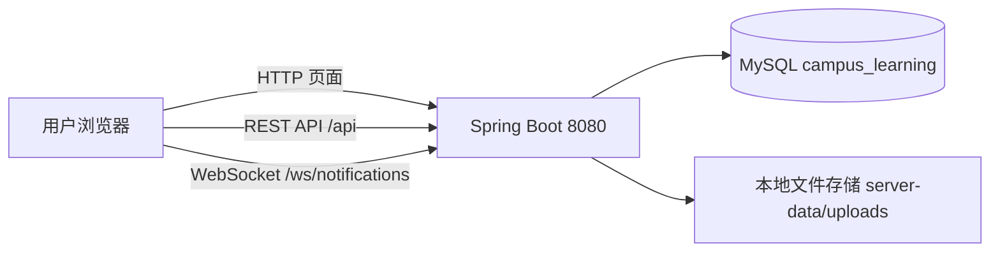
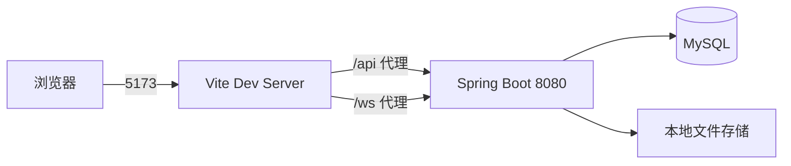
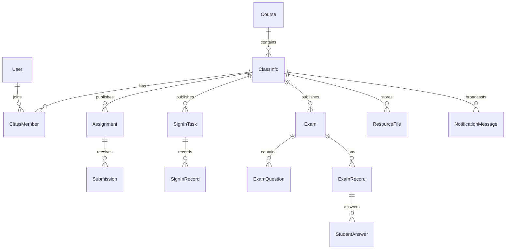
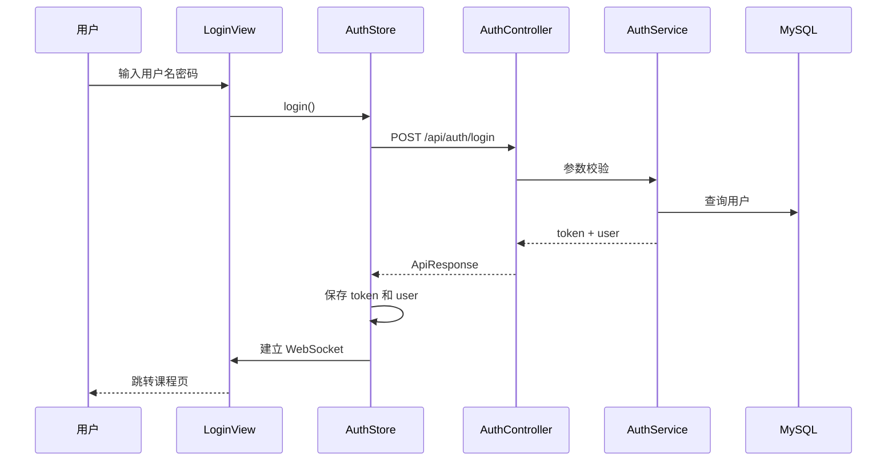
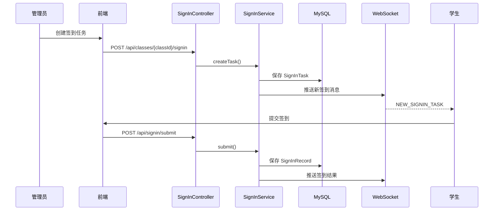
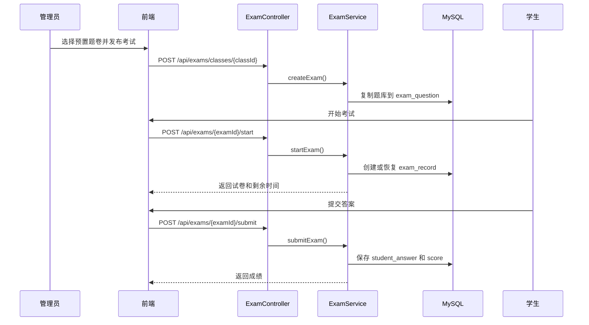

# 校园在线学习平台技术文档

## 1. 项目概述

本项目是一个面向局域网场景的校园在线学习平台，定位为“服务机统一托管，用户机浏览器直接访问”的教学业务系统。系统支持登录认证、课程与班级管理、签到、作业、考试、资料库、通知等核心能力。

当前项目采用前后端分层开发、后端统一部署的模式：

- 开发模式：前端通过 Vite 独立启动，代理 `/api` 与 `/ws` 到 Spring Boot。
- 运行模式：前端构建后同步到 Spring Boot 静态目录，由后端统一通过 `8080` 端口对外提供页面、接口和 WebSocket 服务。

该模式适合局域网教学环境，学生或教师设备无需安装源码和运行环境，只需访问服务机地址即可使用系统。

## 2. 技术栈

### 2.1 前端

- Vue 3
- TypeScript
- Vite 5
- Vue Router 4
- Pinia
- Element Plus
- Axios
- WebSocket
- Vitest

前端依赖定义见 [package.json](file:///d:/软件工程/package.json)。

### 2.2 后端

- Java 8
- Spring Boot 2.7.18
- Spring Web
- Spring Validation
- Spring Data JPA
- Spring WebSocket
- BCrypt 密码加密
- JWT 鉴权
- Maven

后端依赖定义见 [pom.xml](file:///d:/软件工程/server/pom.xml)。

### 2.3 数据与存储

- MySQL 8
- Hibernate / JPA 实体映射
- 本地文件存储

默认配置见 [application.yml](file:///d:/软件工程/server/src/main/resources/application.yml)：

- 数据库：`campus_learning`
- 文件目录：`./server-data/uploads`
- 服务端口：`8080`

## 3. 总体架构

### 3.1 架构风格

系统整体采用“前端 SPA + 后端 REST API + WebSocket + MySQL + 本地文件存储”的分层架构。

- 展示层：Vue 页面、Element Plus 组件、Pinia 状态管理
- 接口层：Spring MVC Controller
- 业务层：Service 负责权限、流程、事务和业务规则
- 数据层：JPA Repository 负责实体持久化
- 实时通道：WebSocket 用于通知、签到提醒、考试同步
- 文件层：本地磁盘保存作业附件、资料、提交文件

### 3.2 部署架构



### 3.3 开发架构



Vite 代理配置见 [vite.config.ts](file:///d:/软件工程/vite.config.ts)。

## 4. 目录结构

```text
d:\软件工程
├─ src                          # 前端源码
│  ├─ api                       # API 封装
│  ├─ components                # 通用组件
│  ├─ config                    # 运行时配置
│  ├─ router                    # 路由配置
│  ├─ stores                    # Pinia 状态管理
│  ├─ utils                     # 请求、时间、距离、WebSocket 工具
│  ├─ views                     # 页面组件
│  └─ types                     # 前端类型定义
├─ scripts
│  └─ sync-to-server-static.mjs # 前端构建产物同步到后端静态目录
├─ server
│  ├─ src/main/java/com/campuslearning/server
│  │  ├─ common                 # 统一响应、异常
│  │  ├─ config                 # MVC、密码、种子数据、WebSocket 配置
│  │  ├─ controller             # 控制器
│  │  ├─ dto                    # 接口入参 DTO
│  │  ├─ model                  # JPA 实体
│  │  ├─ repository             # 数据访问层
│  │  ├─ security               # JWT、拦截器、用户上下文
│  │  ├─ service                # 业务服务
│  │  ├─ util                   # 工具类
│  │  └─ websocket              # WebSocket 处理器
│  └─ src/main/resources
│     ├─ application.yml        # 服务配置
│     └─ static                 # 前端构建后静态资源
├─ start-cs.bat                 # 一键启动脚本
├─ start-cs.ps1
├─ stop-cs.bat                  # 一键停止脚本
└─ stop-cs.ps1
```

## 5. 前端架构设计

### 5.1 应用入口

前端入口见 [main.ts](file:///d:/软件工程/src/main.ts)。

初始化流程如下：

1. 创建 Vue 应用
2. 注册 Pinia
3. 注册 Vue Router
4. 注册 Element Plus
5. 从 localStorage 恢复登录态
6. 挂载根组件

### 5.2 路由设计

路由定义见 [router/index.ts](file:///d:/软件工程/src/router/index.ts)。

核心路由：

- `/login`：登录页
- `/courses`：课程与班级列表
- `/classes/:classId`：班级详情
- `/classes/:classId/signin`：签到页
- `/classes/:classId/assignments`：作业列表页
- `/assignments/:assignmentId/submit`：作业提交页
- `/classes/:classId/exams`：考试管理页
- `/exams/:examId`：考试作答页
- `/classes/:classId/resources`：资料库
- `/notifications`：通知页
- `/profile`：个人中心

路由守卫规则：

- 访问受保护路由时，必须存在 `campus_token`
- 同时必须能识别当前服务端访问地址
- 已登录用户访问 `/login` 会自动跳转到 `/courses`

### 5.3 运行时地址策略

运行时地址逻辑见 [runtime.ts](file:///d:/软件工程/src/config/runtime.ts)。

核心策略：

- 优先使用浏览器当前访问地址
- 若不是后端统一托管模式，则回退到 localStorage 中保存的服务地址
- API 地址统一拼接为 `${origin}/api`
- WebSocket 地址统一拼接为 `${protocol}//${host}/ws/notifications`

这使项目同时兼容：

- 统一托管模式：访问 `http://服务机IP:8080`
- 开发模式：前端 `5173` + 后端 `8080`

### 5.4 HTTP 请求封装

请求封装见 [request.ts](file:///d:/软件工程/src/utils/request.ts) 和 [api/index.ts](file:///d:/软件工程/src/api/index.ts)。

特征如下：

- Axios 请求拦截器统一注入 `baseURL`
- 自动携带 `Authorization: Bearer <token>`
- 统一处理 `401 / 403 / timeout / Network Error`
- API 模块按业务域封装，避免页面直接拼 URL
- 后端统一响应格式为：

```json
{
  "code": 200,
  "data": {},
  "message": "success"
}
```

### 5.5 WebSocket 封装

WebSocket 客户端见 [ws.ts](file:///d:/软件工程/src/utils/ws.ts)。

能力包括：

- 单例连接管理
- 断线自动重连
- 心跳保活
- 按消息类型分发监听器

主要消息用途：

- 新通知提醒
- 新签到任务提醒
- 考试时间同步
- 考试强制交卷

### 5.6 状态管理

Pinia Store 划分如下：

- `auth.ts`：登录用户、Token、登录退出逻辑
- `course.ts`：课程列表、当前班级详情
- `exam.ts`：当前考试题卷、答案、倒计时、切屏次数
- `notification.ts`：通知列表与未读状态
- `server.ts`：服务端地址状态

设计原则：

- 全局共享的运行态放 Store
- 页面独有数据放在页面内部管理
- WebSocket 推送先更新 Store，再驱动页面刷新

## 6. 后端架构设计

### 6.1 分层结构

后端源码位于 [server/src/main/java/com/campuslearning/server](file:///d:/软件工程/server/src/main/java/com/campuslearning/server)。

分层职责如下：

- `controller`：接收请求、参数校验、调用 Service
- `service`：业务编排、权限校验、事务控制
- `repository`：JPA 数据访问
- `model`：数据库实体映射
- `dto`：接口请求对象
- `security`：JWT、拦截器、当前用户上下文
- `websocket`：实时消息处理
- `common`：统一响应和统一异常

### 6.2 API 层

主要控制器：

- `AuthController`：登录
- `CourseController`：课程创建、加入、列表、退出、解散
- `ClassController`：班级创建、加入、详情、邀请码重置、解散
- `SignInController`：签到任务创建、查询、提交
- `AssignmentController`：作业发布、列表、详情、提交
- `ExamController`：题卷模板、考试创建、开始、提交、作弊上报、成绩详情
- `ResourceController`：资料上传与列表
- `NotificationController`：通知发布与查询
- `FileController`：文件下载

### 6.3 业务层

关键服务：

- `AuthService`：账号密码校验，签发 JWT
- `UserService`：获取当前用户、角色限制
- `CourseService`：课程/班级核心服务，也是很多业务的权限入口
- `SignInService`：签到任务、位置签到、结果推送
- `AssignmentService`：作业发布、提交、附件管理
- `ExamService`：题库模板、发布考试、开始考试、自动判分、作弊记录
- `ResourceService`：资料上传与列表
- `NotificationService`：通知入库与实时推送
- `FileStorageService`：统一文件读写、路径管理、删除

### 6.4 鉴权机制

鉴权由 [WebConfig.java](file:///d:/软件工程/server/src/main/java/com/campuslearning/server/config/WebConfig.java) 和 [AuthInterceptor.java](file:///d:/软件工程/server/src/main/java/com/campuslearning/server/security/AuthInterceptor.java) 实现。

流程：

1. `/api/auth/**` 登录接口放行
2. 其他 `/api/**` 请求进入拦截器
3. 从 `Authorization` 头中提取 Bearer Token
4. 通过 `JwtUtil` 解析并校验
5. 将用户信息写入线程上下文 `UserContext`
6. Service 通过 `UserService.getCurrentUser()` 获取当前登录用户

权限控制主要放在 Service 层，例如：

- `ensureMember()`
- `ensureClassAdmin()`
- `requireTeacher()`

这使控制器保持轻量，业务权限逻辑集中。

### 6.5 WebSocket 机制

配置见 [WebSocketConfig.java](file:///d:/软件工程/server/src/main/java/com/campuslearning/server/config/WebSocketConfig.java)，处理器见 [NotificationWebSocketHandler.java](file:///d:/软件工程/server/src/main/java/com/campuslearning/server/websocket/NotificationWebSocketHandler.java)。

特点：

- 地址：`/ws/notifications`
- 连接时通过 query 参数传 `token`
- 服务端维护 `userId -> WebSocketSession` 映射
- 业务服务根据用户 ID 定向推送消息

## 7. 数据模型设计

### 7.1 核心实体

主要实体如下：

- `User`：用户
- `Course`：课程
- `ClassInfo`：班级
- `ClassMember`：班级成员关系
- `SignInTask`：签到任务
- `SignInRecord`：签到记录
- `Assignment`：作业
- `Submission`：作业提交
- `QuestionBankItem`：预置题库条目
- `Exam`：考试
- `ExamQuestion`：考试题目快照
- `ExamRecord`：考试记录
- `StudentAnswer`：学生答题记录
- `ResourceFile`：资料文件
- `NotificationMessage`：通知消息

### 7.2 实体关系



### 7.3 数据管理特点

- 使用 JPA 实体直接映射数据库表
- 通过 Repository 命名查询完成大部分 CRUD
- `ddl-auto: update` 允许启动时自动更新表结构
- 启动时自动插入基础账号和考试题库

种子数据初始化见 [DatabaseSeedConfig.java](file:///d:/软件工程/server/src/main/java/com/campuslearning/server/config/DatabaseSeedConfig.java)。

## 8. 文件存储设计

文件系统由 [FileStorageService.java](file:///d:/软件工程/server/src/main/java/com/campuslearning/server/service/FileStorageService.java) 统一管理。

主要文件类型：

- 作业附件
- 学生作业提交文件
- 课程资料

设计特点：

- 按业务分类保存文件
- 支持按课程/班级目录隔离
- 删除课程或班级时同步删除数据库记录和物理文件
- 下载由 `FileController` 统一提供接口

文件同步删除的核心逻辑位于 [CourseService.java](file:///d:/软件工程/server/src/main/java/com/campuslearning/server/service/CourseService.java)。

## 9. 核心数据流

### 9.1 登录数据流



### 9.2 课程与班级数据流

1. 用户在课程页创建课程
2. 前端调用课程创建接口
3. 后端创建 `Course`
4. 同时自动创建默认班级 `ClassInfo`
5. 创建者自动加入默认班级
6. 返回班级信息给前端，前端刷新课程列表

### 9.3 签到数据流



### 9.4 作业与文件流

1. 管理员在作业页发布作业
2. 前端通过 `multipart/form-data` 上传附件
3. 后端保存附件到本地目录，并将元数据写入数据库
4. 学生提交作业时再次上传文件
5. 提交记录与文件路径一起入库
6. 下载时通过统一文件下载接口读取磁盘内容

### 9.5 考试数据流



### 9.6 通知数据流

1. 管理员发布通知
2. 后端写入 `NotificationMessage`
3. 查出班级成员列表
4. 对在线成员逐个通过 WebSocket 推送
5. 前端壳层接收实时消息并更新通知 Store

## 10. 统一部署与静态资源托管

为支持“用户机只需访问链接”的目标，前端构建产物会被同步到后端静态目录。

同步脚本见 [sync-to-server-static.mjs](file:///d:/软件工程/scripts/sync-to-server-static.mjs)。

流程如下：

1. 执行 `npm run build`
2. 生成前端 `dist`
3. 删除后端旧 `static`
4. 将 `dist` 复制到 `server/src/main/resources/static`
5. Spring Boot 启动后直接托管前端页面

SPA 路由转发由 [SpaForwardController.java](file:///d:/软件工程/server/src/main/java/com/campuslearning/server/controller/SpaForwardController.java) 负责，保证刷新页面不会出现 404。

## 11. 运行与部署

### 11.1 开发模式

前端：

```bash
npm run dev -- --host 0.0.0.0 --port 5173
```

后端：

```bash
cd server
mvn spring-boot:run
```

### 11.2 统一托管模式

构建并同步前端：

```bash
npm run build:cs
```

启动后端：

```bash
cd server
mvn spring-boot:run
```

访问入口：

- 本机：`http://localhost:8080`
- 局域网：`http://服务机IP:8080`

### 11.3 辅助脚本

项目根目录已提供：

- [start-cs.bat](file:///d:/软件工程/start-cs.bat)：一键启动
- [stop-cs.bat](file:///d:/软件工程/stop-cs.bat)：一键停止

## 12. 安全与权限设计

### 12.1 认证

- 用户登录后获得 JWT
- 所有业务接口通过 Bearer Token 鉴权
- Token 过期后前端自动清理本地登录态并跳转登录页

### 12.2 授权

当前项目采用“资源创建者即管理员”的资源级权限模型：

- 每个用户都可以创建课程
- 课程创建者自动成为课程管理员
- 课程管理员可以创建班级
- 班级管理员可以发布通知、资料、签到、作业、考试
- 普通成员只能加入、查看、提交、作答

### 12.3 文件安全

- 下载统一走后端接口
- 文件路径由服务端控制，不由前端直接拼物理路径
- 删除课程或班级时会级联删除数据库记录和存储文件

## 13. 当前架构优势与边界

### 13.1 优势

- 统一托管，局域网访问简单
- 前后端边界清晰，开发效率高
- JPA 实体化后数据持久化完整
- WebSocket 实时推送适合通知、签到、考试场景
- 文件与业务数据已做课程/班级隔离

### 13.2 当前边界

- 权限控制主要在 Service 内手工校验，尚未演进到更细粒度的统一鉴权框架
- 文件存储目前为本地磁盘，适合单机部署，不适合多实例横向扩展
- WebSocket 当前主要服务通知和考试同步，尚未做更复杂的消息确认和离线补偿
- `ddl-auto: update` 适合开发阶段，生产环境建议切换为显式数据库迁移方案

## 14. 后续演进建议

- 引入数据库迁移工具，如 Flyway 或 Liquibase
- 将本地文件存储升级为 MinIO 或对象存储
- 增加更完善的审计日志和操作日志
- 将权限模型从“课程/班级管理员”继续扩展到更细粒度的资源权限
- 为考试、作业、通知增加分页、筛选、统计报表
- 为 WebSocket 增加断线补偿与消息确认机制

---

如需继续扩展，本文件建议下一步补充两类内容：

- API 清单与请求示例
- 数据库表结构说明与字段字典
